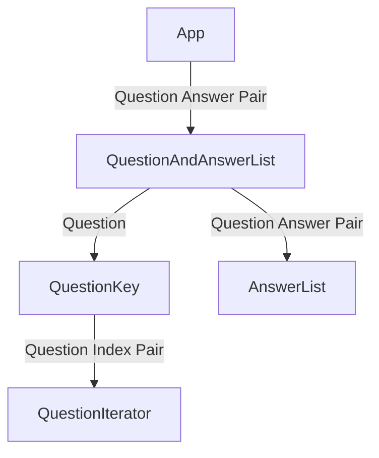
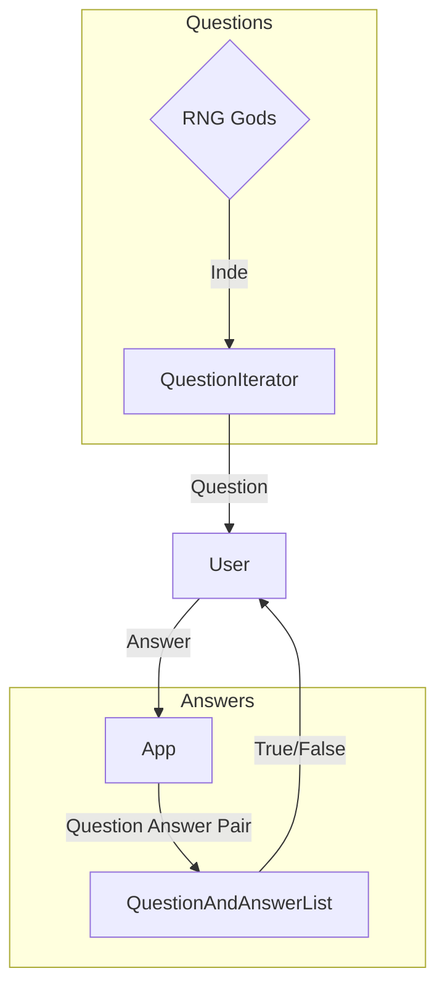

# Timeline Trivia

## General Idea

Design an app that takes in community trivia questions

## Project Structure

Created in Android Studio. Major project file structure

- Base files were edits are expected (Simplified Project Structure)
    - app > src
        - androidTest
        - main
            - java > com > example > timeline_trivia
                - MainActivity > The main java class that runs the main page and creates the other classes
                - QuestionMaster > DataStructure and storage for saving, asking, and checking question answer pairs
                    - Much of this runs in constant time via the use of cross referencing datastructures (IE. Some delete in constant time, some return the last input in constant time, etc.)
                    - The trick here is maintaining all cross references as updates are made to the project
            - res
                - layout
                    - activity_main > Currently the only working page in the project front end
    - README
        - This is only of note to promote the use of VS Code to edit this file, since the Android Studio plugin has broken since at least 2020 and the offered solution breaks with every update according to JetBrains own doccumentation [link](https://issuetracker.google.com/issues/159933628?pli=1#comment7) (most currently flamingo where it does not work at all)

## Data Structure In Depth

- QuestionAndAnswerList HashMap<String, (AnswerList)HashSet\<String>>
    - [Documentation](https://docs.oracle.com/javase/8/docs/api/java/util/HashMap.html)
    - Functions used
        - Put: Constant Time - O(1)
        - Get: Constant Time - O(1)
        - Replace: Should be a Remove followed by a Put?
        - Remove: Unknown / Unspecified 
            - Ideally this would not be used when we move to databases
            - Possible alternative: When a database is implemented, questions can be removed directly and the overall structure wiped and reloaded in bulk
        - Replace: Should be a Remove followed by a Put?
    - Reasoning and Usage
        - Constant time to store question and answer pairs
        - Constant time to retrieve Answers paired with a question
        - Serves as the **base** data structure for the functional game
    - Limitaions
        - Unknown how long it may take to remove or replace questions, making updated infeasible
- QuestionKey HashMap<String, Integer>
    - [Documentation](https://docs.oracle.com/javase/8/docs/api/java/util/HashMap.html)
    - Functions used
        - Put: Constant Time - O(1)
        - Get: Constant Time - O(1)
        - Contains Key: Should be a get in Constant Time - O(1)
        - Remove: Unknown / Unspecified
            - [See above](#HashMapRemove)
    - Reasoning and Usage
        - Constant time to store questions
        - Question acts as a key to lookup the index in the iterator ArrayList
        - Serves as the **go-between** for the *base* data structure (QuestionAndAnswerList) and the *random retrieval* structure (QuestionIterator)
    - Limitaions
        - Unknown how long it may take to remove or replace questions, making updated infeasible
        - Using raw Strings as keys is not ideal
- QuestionIterator ArrayList\<String>
    - [Documentation](https://docs.oracle.com/javase/8/docs/api/java/util/ArrayList.html)
    - Functions used
        - Add: Amortized Constant Time - O(n)\+
            - [Help](https://stackoverflow.com/questions/200384/what-is-constant-amortized-time) from the best sorce on anything
        - Get: Constant Time - O(1)
        - Size: Constant Time - O(1)
        - Remove: Linear Time - O(n)
    - Reasoning and Usage
        - Constant time to get a question when the index is known. Defined [above](#QuestionKeyIndex)
        - Amortized Constant Time to add questions
        - Allows **'random' retrieval** of questions by generating indexes within the bounds of indexed questions
    - Limitaions
- AnswerList HashSet\<String>
    - [Documentation](https://docs.oracle.com/javase/7/docs/api/java/util/HashSet.html)
    - Functions used
        - Add: Constant Time - O(1)
        - Contains: Constant Time - O(1)
        - Size: Constant Time - O(1)
    - Reasoning and Usage
        - Constant time to store new answers
        - Constant time to check if a passed in answer exists (is correct) for the question
        - Allows any number of answers to be associated to a single quesiton
    - Limitaions
        - Surprizingly cannot return any value therefore cannot give a correct answer for example

### Storage Graph

### Retrieval Graph

## TODO short(ish) term

- [x] Verify Code can work on other machines
    - kb: the app runs, and buttons are displayed. Questions do not always display, I added a task for this in Trello.

- [~] General file cleanup and gitignore population
    - kb: I made a /proj directory to track any project management stuff, which I'm including this under. Please review the file_cleanup.txt file to see how much I guessed right. I don't think any of the gradle files need to be excluded or cleaned, outside the generated /app/build files.